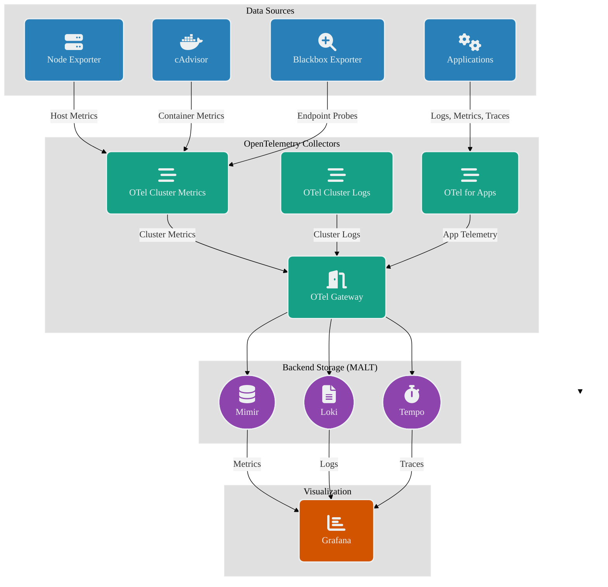

```yaml
qwen3-next-80b-a3b-instruct
text-embedding-nomic-embed-text-v1.5


extensions:
  basicauth/internal_metrics:
    client_auth:
      username: "your-username"  # Use environment variables or secrets in production
      password: "your-password"  # Use environment variables or secrets in production

# 2. Define receivers for incoming data
receivers:
  otlp:
    protocols:
      grpc:
      http:
  kubeletstats:
    collection_interval: 10s
    auth_type: "serviceAccount"
    endpoint: "${env:K8S_NODE_NAME}:10250"
    insecure_skip_verify: true
    metric_groups:
      - container
      - pod
      - node
      - volume

# 3. Define processors for data transformation
processors:
  memory_limiter:
    check_interval: 1s
    limit_percentage: 75
    spike_limit_percentage: 15
  batch:
  resourcedetection:
    detectors: [env, system, eks]
    override: true
  resource/rename_cluster:
    attributes:
      - key: k8s.cluster.name
        value: "prod-cluster-project-alpha"
        action: upsert

# 4. Define exporters for sending data
exporters:
  otlp:
    endpoint: "your-backend-endpoint:4317"

# 5. Define the service and pipelines
service:
  # Enable the extensions
  extensions: [basicauth/internal_metrics]

  # Configure internal telemetry
  telemetry:
    metrics:
      level: "normal"
      readers:
        - periodic:
            interval: 60s
            exporter:
              otlp:
                protocol: http/protobuf
                endpoint: "your-internal-metrics-endpoint:4318"
                auth:
                  authenticator: basicauth/internal_metrics
```
```yaml
# This values.yaml configures the opentelemetry-collector Helm chart
# to run as a highly available, stateful gateway.

# Set the deployment mode to 'statefulset'. This is the key to enabling
# stable pod identities and persistent storage. [1, 2]
mode: statefulset

# Run multiple replicas for high availability and load distribution.
# A minimum of 3 is recommended for production environments. [3, 4]
replicaCount: 3

# Use the 'contrib' distribution image to ensure all necessary components,
# like the filestorage extension and k8sattributes processor, are available. [1, 5]
image:
  repository: otel/opentelemetry-collector-contrib
  # It's recommended to use a recent, stable version.
  tag: 0.100.0

# The 'statefulset' block allows for configuring StatefulSet-specific properties.
# The 'volumeClaimTemplates' section is the standard Kubernetes way to provide
# each replica with its own persistent volume. [6, 7]
statefulset:
  volumeClaimTemplates:
    - metadata:
        # This name is used to create the PersistentVolumeClaim for each pod.
        name: otel-gateway-storage
      spec:
        accessModes:
        # Ensure you have a StorageClass available in your cluster.
        storageClassName: "standard"
        resources:
          requests:
            # Allocate sufficient disk space for the persistent queue.
            storage: 20Gi

# Mount the persistent volume into the collector container. The 'name' must
# match the 'name' from the volumeClaimTemplates metadata above.
volumeMounts:
  - name: otel-gateway-storage
    mountPath: /var/lib/otelcol/data

# This section defines the collector's core configuration (config.yaml).
config:
  extensions:
    # The filestorage extension enables the disk-backed persistent queue. [8, 9]
    # Its directory must match the 'mountPath' from the volumeMounts.
    filestorage:
      directory: /var/lib/otelcol/data

    # Standard extensions for production readiness and debugging.
    health_check:
    pprof:

  receivers:
    otlp:
      protocols:
        grpc:
          endpoint: 0.0.0.0:4317
        http:
          endpoint: 0.0.0.0:4318

  processors:
    # 1. memory_limiter: MUST be the first processor. It acts as the primary
    #    defense against memory exhaustion and applies backpressure. [10]
    memory_limiter:
      check_interval: 1s
      # Use percentage-based limits, which are ideal for containerized environments.
      # Adjust based on the resource limits set for your pods.
      limit_percentage: 80
      spike_limit_percentage: 20

    # 2. k8sattributes: Enriches telemetry with Kubernetes metadata. Essential
    #    for a gateway to add context to data from various sources. [5, 11]
    k8sattributes:
      passthrough: false
      auth_type: "kubeConfig"
      extract:
        metadata:
          - k8s.pod.name
          - k8s.pod.uid
          - k8s.deployment.name
          - k8s.namespace.name
          - k8s.node.name

    # 3. batch: Groups data for more efficient compression and export.
    batch:
      # A gateway with more resources can often handle larger batches.
      send_batch_size: 8192
      send_batch_max_size: 8192
      timeout: 5s

  exporters:
    # Replace this with your actual backend exporter configuration.
    otlphttp:
      endpoint: "https://your-observability-backend.com:443"
      # The sending_queue is critical for resilience.
      sending_queue:
        enabled: true
        # Use the 'filestorage' extension for a persistent Write-Ahead Log (WAL).
        # This makes the queue durable across pod restarts, which is the primary
        # reason for using a StatefulSet. [8, 3]
        storage: filestorage
        # A large queue size allows buffering during extended backend outages.
        queue_size: 50000
      retry_on_failure:
        enabled: true
        max_elapsed_time: 15m # Retry for 15 minutes before dropping data.

  service:
    extensions: [health_check, pprof, filestorage]
    pipelines:
      metrics:
        receivers: [otlp]
        processors: [memory_limiter, k8sattributes, batch]
        exporters: [otlphttp]
      traces:
        receivers: [otlp]
        processors: [memory_limiter, k8sattributes, batch]
        exporters: [otlphttp]
      logs:
        receivers: [otlp]
        processors: [memory_limiter, k8sattributes, batch]
        exporters: [otlphttp]
    # Enable self-monitoring of the collector gateway fleet.
    telemetry:
      metrics:
        address: 0.0.0.0:8888
```




```
import (
	"regexp"
	"strings"
)

func splitYAMLDocs(yamlData string) []string {
	// Regex to match "---" that is not part of a comment
	re := regexp.MustCompile(`(?m)^---\s*$`) 
	return re.Split(yamlData, -1)
}
```
```
// Get the command's stdin pipe
	stdin, err := cmd.StdinPipe()
	if err != nil {
		fmt.Println("Error creating stdin pipe:", err)
		return
	}

	// Start the command
	err = cmd.Start()
	if err != nil {
		fmt.Println("Error starting command:", err)
		return
	}

	// Write the template output to the command's stdin
	_, err = io.Copy(stdin, &tplOutput)
	if err != nil {
		fmt.Println("Error copying data to stdin:", err)
		return
	}

	// Close the stdin pipe
	err = stdin.Close()
	if err != nil {
		fmt.Println("Error closing stdin:", err)
		return
	}

	// Wait for the command to finish
	err = cmd.Wait()
	if err != nil {
		fmt.Println("Error waiting for command:", err)
		return
	}
```


```
project: my-project
configVersion: 1
---
images:
- image: app1
  from: alpine
  ansible:
    beforeInstall:
    {{- include "ruby" . }}
- image: app2
  from: alpine
  ansible:
    beforeInstall:
    {{- include "ruby" . }}
{{- define "ruby" }}
- command: gpg --keyserver hkp://keys.gnupg.net --recv-keys 409B6B1796C275462A1703113804BB82D39DC0E3
- get_url:
    url: https://raw.githubusercontent.com/rvm/rvm/master/binscripts/rvm-installer
    dest: /tmp/rvm-installer
- name: "Install rvm"
  command: bash -e /tmp/rvm-installer
- name: "Install ruby 2.3.4"
  raw: bash -lec "{{ . | quote }}"
  with_items:
  - rvm install 2.3.4
  - rvm use --default 2.3.4
  - gem install bundler --no-ri --no-rdoc
  - rvm cleanup all
{{- end }}
```
```
import (
    "context"
    "fmt"

    "github.com/GoogleContainerTools/skaffold/pkg/skaffold/runner"
    "github.com/GoogleContainerTools/skaffold/pkg/skaffold/schema/latest"   

)

cfg, err := latest.GetConfigSet(configFile, latest.WithRunMode(latest.RunModeDev)) // Adjust RunMode as needed
if err != nil {
    return fmt.Errorf("error loading Skaffold config: %w", err)
}

runner, err := runner.NewForConfig(context.Background(), cfg)
if err != nil {
    return fmt.Errorf("error creating Skaffold runner: %w", err)
}

err = runner.Run(context.Background(), os.Stdout, os.Stderr, "build") // Replace "build" with the desired action
if err != nil {
    return fmt.Errorf("error running Skaffold: %w", err)
}
```

```
// Get the Google Cloud auth token
    token, err := getGoogleCloudAuthToken()
    if err != nil {
        return fmt.Errorf("failed to get Google Cloud auth token: %w", err)
    }
```
```
func isSkaffoldInitialized() (bool, error) {
    // Check if the file exists
    _, err := os.Stat(".skaffold_initialised")
    if err != nil {
        if os.IsNotExist(err) {
            return false, nil // File doesn't exist
        }
        return false, err // Some other error occurred
    }

    // File exists and is not a directory
    return true, nil
}

func createSkaffoldInitializedFile() error {
    // Create an empty file
    file, err := os.Create(".skaffold_initialised")
    if err != nil {
        return fmt.Errorf("failed to create .skaffold_initialised file: %w", err)
    }
    defer file.Close()
    return nil
}
```

```
func runSkaffoldInit(args []string) error {
    cmd := exec.Command("skaffold", args...)

    // Capture stdout and stderr in buffers
    var stdoutBuf, stderrBuf bytes.Buffer
    cmd.Stdout = &stdoutBuf
    cmd.Stderr = &stderrBuf

    // Run the command
    err := cmd.Run()
    if err != nil {
        // If the command exits uncleanly, print the captured output
        fmt.Println("Skaffold initialization failed:")
        fmt.Println(stdoutBuf.String())
        fmt.Println(stderrBuf.String())
        return err
    }

    return nil 
}
```


allSettings := viper.AllSettings() 

	// Iterate over the map and access values using their original case
	for key, value := range allSettings {
		fmt.Println(key, ":", value)
	}

```
viper.SetEnvKeyReplacer(strings.NewReplacer())
```
```
package main

import (
	"context"
	"flag"
	"fmt"
	"log"
	"os"
	"path/filepath"

	"golang.org/x/oauth2/google"
	"google.golang.org/api/container/v1"
	"google.golang.org/api/option"
	"k8s.io/client-go/tools/clientcmd"
	"k8s.io/client-go/tools/clientcmd/api"
	"k8s.io/client-go/util/homedir"
)

func main() {
	// 1. Define and Parse Flags
	clusterName := flag.String("cluster", "", "Name of the GKE cluster")
	region := flag.String("region", "", "Region of the GKE cluster (required)")
	project := flag.String("project", "", "Project ID (optional)")
	flag.Parse()

	if *region == "" {
		fmt.Println("Error: --region is required for GKE clusters")
		os.Exit(1)
	}
        clusterResourceName := fmt.Sprintf("projects/%s/locations/%s/clusters/%s", *project, *region, *clusterName)
	// 2. Load Google Cloud Credentials (Application Default Credentials)
	creds, err := google.FindDefaultCredentials(context.Background(), container.CloudPlatformScope)
	if err != nil {
		log.Fatalf("Error loading Google Cloud credentials: %v", err)
	}

	if *project == "" {
		*project = creds.ProjectID
	}

	// 3. Create GKE Client
	ctx := context.Background()
	containerService, err := container.NewService(ctx, option.WithCredentials(creds))
	if err != nil {
		log.Fatalf("Error creating GKE client: %v", err)
	}

	// 4. Get Cluster Details
	cluster, err := containerService.Projects.Locations.Clusters.Get(*project, *region, *clusterName).Context(ctx).Do()
	if err != nil {
		log.Fatalf("Error getting cluster details: %v", err)
	}

	// 5. Extract and Configure Kubernetes Credentials
	fmt.Printf("Fetching credentials for GKE cluster '%s' in region '%s' (project: %s)\n", *clusterName, *region, *project)

	// Extract necessary information from the 'cluster' object
	endpoint := cluster.Endpoint
	certificateAuthorityData := cluster.MasterAuth.ClusterCaCertificate

	// 6. Update kubeconfig
	kubeconfigPath := filepath.Join(homedir.HomeDir(), ".kube", "config")
	config, err := clientcmd.LoadFromFile(kubeconfigPath)
	if err != nil {
		log.Fatalf("Error loading kubeconfig: %v", err)
	}

        / 6. Extract and Configure Kubernetes Credentials
    fmt.Printf("Fetching credentials for GKE cluster '%s' in region '%s' (project: %s)\n", *clusterName, *region, *project)

    // Extract necessary information from the 'cluster' object
    endpoint := cluster.Endpoint
    certificateAuthorityData := cluster.MasterAuth.ClusterCaCertificate


   certificateAuthorityData := cluster.MasterAuth.ClusterCaCertificate

	// Decode the Base64-encoded certificate authority data
	decodedCert, err := base64.StdEncoding.DecodeString(certificateAuthorityData)
	if err != nil {
		log.Fatalf("Error decoding certificate authority data: %v", err)
	}

	// Encode the decoded certificate data in PEM format
	pemBlock := &pem.Block{
		Type:  "CERTIFICATE",
		Bytes: decodedCert,
	}
	pemEncodedCert := pem.EncodeToMemory(pemBlock)

	// Remove any padding from the PEM-encoded certificate
	pemEncodedCert = []byte(strings.TrimRight(string(pemEncodedCert), "="))


    // Encode certificate authority data in PEM format
    pemBlock := &pem.Block{
        Type:  "CERTIFICATE",
        Bytes: []byte(certificateAuthorityData),
    }
    pemEncodedCert := pem.EncodeToMemory(pemBlock)

    // 7. Update kubeconfig
    kubeconfigPath := filepath.Join(homedir.HomeDir(), ".kube", "config")
    config, err := clientcmd.LoadFromFile(kubeconfigPath)
    if err != nil {
        log.Fatalf("Error loading kubeconfig: %v", err)
    }

    // Create or update cluster entry in kubeconfig
    newCluster := &api.Cluster{
        Server:                   endpoint,
        CertificateAuthorityData: pemEncodedCert, // Use the PEM-encoded certificate
    }


	// Create or update cluster entry in kubeconfig
	newCluster := &api.Cluster{
		Server:                   endpoint,
		CertificateAuthorityData: []byte(certificateAuthorityData),
	}

	newAuthInfo := &api.AuthInfo{
		AuthProvider: &api.AuthProviderConfig{
			Name: "gcp",
			Config: map[string]string{
				"cmd-args":        "config config-helper --format=json",
				"cmd-path":        "gcloud",
				"expiry-key":      "{.credential.token_expiry}",
				"token-key":       "{.credential.access_token}",   

				"access-token-key": "{.credential.access_token}",
			},
		},
	}

	newContext := &api.Context{
		Cluster:  *clusterName,
		AuthInfo: *clusterName,
	}

	config.Clusters[*clusterName] = newCluster
	config.AuthInfos[*clusterName] = newAuthInfo
	config.Contexts[*clusterName] = newContext
	config.CurrentContext = *clusterName

	err = clientcmd.WriteToFile(*config, kubeconfigPath)
	if err != nil {
		log.Fatalf("Error writing kubeconfig: %v", err)
	}

	fmt.Println("Credentials fetched and configured successfully!")
}
```

```
package main

import (
    "fmt"
    "os"
    "os/exec"
    "strings"

    "github.com/spf13/cobra"
    "github.com/spf13/viper"
)

type Target struct {
    Name      string            `mapstructure:"name"`
    Variables map[string]string `mapstructure:"variables"`
}

func main() {
    var configFile string
    var targetName string

    rootCmd := &cobra.Command{
        Use:   "skaffmate [target] [skaffold args...]",
        Short: "Skaffold wrapper with environment variable management",
        Args:  cobra.MinimumNArgs(1),
        Run: func(cmd *cobra.Command, args []string) {
            targetName = args[0]
            skaffoldArgs := args[1:]

            // Load configuration
            viper.SetConfigFile(configFile)
            viper.SetConfigType("yaml")
            if err := viper.ReadInConfig(); err != nil {
                fmt.Println("Error reading config file:", err)
                os.Exit(1)
            }

            // Find target
            var targets []Target
            if err := viper.UnmarshalKey("targets", &targets); err != nil {
                fmt.Println("Error unmarshaling targets:", err)
                os.Exit(1)
            }

            var selectedTarget *Target
            for _, t := range targets {
                if t.Name == targetName {
                    selectedTarget = &t
                    break
                }
            }

            if selectedTarget == nil {
                fmt.Println("Target not found:", targetName)
                os.Exit(1)
            }

            // Set environment variables
            for k, v := range selectedTarget.Variables {
                os.Setenv("GRAPH_"+k, v)
            }

            // Run skaffold with additional arguments
            runSkaffold(skaffoldArgs)
        },
    }

    rootCmd.Flags().StringVarP(&configFile, "config", "c", "skaffmate.yaml", "Configuration file path")

    if err := rootCmd.Execute(); err != nil {
        fmt.Println("Error:", err)
        os.Exit(1)
    }
}

func runSkaffold(args []string) {
    cmd := exec.Command("skaffold", args...)

    // Get pipes for stdout and stderr
    stdoutPipe, err := cmd.StdoutPipe()
    if err != nil {
        fmt.Println("Error creating stdout pipe:", err)
        os.Exit(1)
    }
    stderrPipe, err := cmd.StderrPipe()
    if err != nil {
        fmt.Println("Error creating stderr pipe:", err)
        os.Exit(1)
    }

    // Start the command
    if err := cmd.Start(); err != nil {
        fmt.Println("Error starting skaffold:", err)
        os.Exit(1)
    }

    // Handle Ctrl+C to kill Skaffold
    c := make(chan os.Signal, 1)
    signal.Notify(c, os.Interrupt)
    go func() {
        <-c
        fmt.Println("\nInterrupt signal received, terminating Skaffold...")
        if err := cmd.Process.Kill(); err != nil {
            fmt.Println("Error killing Skaffold process:", err)
        }
    }()

    // Stream stdout and stderr
    go func() {
        scanner := bufio.NewScanner(stdoutPipe)
        for scanner.Scan() {
            fmt.Println(scanner.Text())
        }
    }()
    go func() {
        scanner := bufio.NewScanner(stderrPipe)
        for scanner.Scan() {
            fmt.Fprintln(os.Stderr, scanner.Text()) // Print to stderr
        }
    }()

    // Wait for the command to finish
    if err := cmd.Wait(); err != nil {
        if exitErr, ok := err.(*exec.ExitError); ok {
            os.Exit(exitErr.ExitCode()) // Propagate Skaffold's exit code
        } else {
            fmt.Println("Error waiting for skaffold:", err)
            os.Exit(1)
        }
    }
}

func runSkaffold2(args []string) {
    cmd := exec.Command("skaffold", args...)

    // Get pipes for stdout and stderr
    stdoutPipe, err := cmd.StdoutPipe()
    if err != nil {
        fmt.Println("Error creating stdout pipe:", err)
        os.Exit(1)
    }
    stderrPipe, err := cmd.StderrPipe()
    if err != nil {
        fmt.Println("Error creating stderr pipe:", err)
        os.Exit(1)
    }

    // Start the command
    if err := cmd.Start(); err != nil {
        fmt.Println("Error starting skaffold:", err)
        os.Exit(1)
    }

    // Handle Ctrl+C to kill Skaffold
    c := make(chan os.Signal, 1)
    signal.Notify(c, os.Interrupt)
    go func() {
        <-c
        fmt.Println("\nInterrupt signal received, terminating Skaffold...")
        if err := cmd.Process.Kill(); err != nil {
            fmt.Println("Error killing Skaffold process:", err)
        }
    }()

    // Copy stdout and stderr directly to the console
    go io.Copy(os.Stdout, stdoutPipe)
    go io.Copy(os.Stderr, stderrPipe)

    // Wait for the command to finish
    if err := cmd.Wait(); err != nil {
        if exitErr, ok := err.(*exec.ExitError); ok {
            os.Exit(exitErr.ExitCode()) 
        } else {
            fmt.Println("Error waiting for skaffold:", err)
            os.Exit(1)
        }
    }
}

func runSkaffold3(args []string) {
    cmd := exec.Command("skaffold", args...)

    // Create a pty
    ptmx, err := pty.Start(cmd)
    if err != nil {
        fmt.Println("Error starting pty:", err)
        os.Exit(1)
    }
    defer ptmx.Close()

    // Make the pty act like the controlling terminal
    if err := term.MakeRaw(int(os.Stdin.Fd())); err != nil {
        fmt.Println("Error making stdin raw:", err)
        os.Exit(1)
    }
    defer term.Restore(int(os.Stdin.Fd()), term.State{}) 

    // Handle Ctrl+C to kill Skaffold
    c := make(chan os.Signal, 1)
    signal.Notify(c, os.Interrupt)
    go func() {
        <-c
        fmt.Println("\nInterrupt signal received, terminating Skaffold...")
        if err := cmd.Process.Kill(); err != nil {
            fmt.Println("Error killing Skaffold process:", err)
        }
    }()

    // Copy pty output to stdout
    go io.Copy(os.Stdout, ptmx)

    // Wait for the command to finish
    if err := cmd.Wait(); err != nil {
        if exitErr, ok := err.(*exec.ExitError); ok {
            os.Exit(exitErr.ExitCode()) 
        } else {
            fmt.Println("Error waiting for skaffold:", err)
            os.Exit(1)
        }
    }
}
```
```
package main

import (
    "crypto/tls"
    "fmt"
    "io/ioutil"
    "log"
    "net/http"
    "net/http/httputil"
    "net/url"
    "os"
)

func main() {
    targetURL, err := url.Parse(os.Getenv("TARGET_URL"))
    if err != nil {
        log.Fatalf("Error parsing TARGET_URL: %v", err)
    }

    customHeaders := map[string]string{
        "X-Custom-Header-1": "Value1",
        "X-Custom-Header-2": "Value2",
        // Add more custom headers as needed
    }

    // TLS configuration (adjust as needed)
    tlsConfig := &tls.Config{
        // InsecureSkipVerify: true, // Use with caution! Only for testing or self-signed certs
        // RootCAs: ... // Provide root CAs if needed
        // ServerName: ... // Set if needed for SNI
    }

    // Configure transport for HTTPS
    transport := &http.Transport{TLSClientConfig: tlsConfig}

    proxy := httputil.NewSingleHostReverseProxy(targetURL)
    proxy.Transport = transport // Set the transport for HTTPS support
    proxy.Director = func(req *http.Request) {
        req.URL.Scheme = targetURL.Scheme
        req.URL.Host = targetURL.Host
        req.Host = targetURL.Host   


        for key, value := range customHeaders {
            req.Header.Set(key, value)
        }
    }

    proxy.ErrorHandler = func(w http.ResponseWriter, r *http.Request, err error) {
        log.Printf("Error proxying request: %v", err)
        // You might want to handle TLS errors more specifically here
        http.Error(w, "Internal Server Error", http.StatusInternalServerError)
    }

    port := os.Getenv("PORT")
    if port == "" {
        port = "8080"
    }
    fmt.Printf("Interception proxy listening on port %s...\n", port)
    log.Fatal(http.ListenAndServe(":"+port, proxy))
}
```

```
#!/bin/sh
set -e

# first arg is `-f` or `--some-option`
if [ "${1#-}" != "$1" ]; then
	set -- memcached "$@"
fi

exec "$@"
```

dockerfile
```
FROM debian:bookworm-slim

# add our user and group first to make sure their IDs get assigned consistently, regardless of whatever dependencies get added
RUN set -eux; \
	groupadd --system --gid 11211 memcache; \
	useradd --system --gid memcache --uid 11211 memcache

# ensure SASL's "libplain.so" is installed as per https://github.com/memcached/memcached/wiki/SASLHowto
RUN set -eux; \
	apt-get update; \
	apt-get install -y --no-install-recommends \
		libsasl2-modules \
	; \
	rm -rf /var/lib/apt/lists/*

ENV MEMCACHED_VERSION 1.6.29
ENV MEMCACHED_URL https://memcached.org/files/memcached-1.6.29.tar.gz
ENV MEMCACHED_SHA1 a9699aed111d86b6e37b3ce5e6ef4e7539582d5f

RUN set -eux; \
	\
	savedAptMark="$(apt-mark showmanual)"; \
	apt-get update; \
	apt-get install -y --no-install-recommends \
		ca-certificates \
		dpkg-dev \
		gcc \
		libc6-dev \
		libevent-dev \
		libio-socket-ssl-perl \
		libsasl2-dev \
		libssl-dev \
		make \
		perl \
		wget \
	; \
	rm -rf /var/lib/apt/lists/*; \
	\
	wget -O memcached.tar.gz "$MEMCACHED_URL"; \
	echo "$MEMCACHED_SHA1  memcached.tar.gz" | sha1sum -c -; \
	mkdir -p /usr/src/memcached; \
	tar -xzf memcached.tar.gz -C /usr/src/memcached --strip-components=1; \
	rm memcached.tar.gz; \
	\
	cd /usr/src/memcached; \
	\
	gnuArch="$(dpkg-architecture --query DEB_BUILD_GNU_TYPE)"; \
	./configure \
		--build="$gnuArch" \
		--enable-extstore \
		--enable-sasl \
		--enable-sasl-pwdb \
		--enable-tls \
	; \
	nproc="$(nproc)"; \
	make -j "$nproc"; \
	\
# see https://github.com/docker-library/memcached/pull/54#issuecomment-562797748 and https://bugs.debian.org/927461 for why we have to munge openssl.cnf
	sed -i.bak 's/SECLEVEL=2/SECLEVEL=1/g' /etc/ssl/openssl.cnf; \
	make test PARALLEL="$nproc"; \
	mv /etc/ssl/openssl.cnf.bak /etc/ssl/openssl.cnf; \
	\
	make install; \
	\
	cd /; \
	rm -rf /usr/src/memcached; \
	\
	apt-mark auto '.*' > /dev/null; \
	apt-mark manual $savedAptMark > /dev/null; \
	find /usr/local -type f -executable -exec ldd '{}' ';' \
		| awk '/=>/ { so = $(NF-1); if (index(so, "/usr/local/") == 1) { next }; gsub("^/(usr/)?", "", so); printf "*%s\n", so }' \
		| sort -u \
		| xargs -r dpkg-query --search \
		| cut -d: -f1 \
		| sort -u \
		| xargs -r apt-mark manual \
	; \
	apt-get purge -y --auto-remove -o APT::AutoRemove::RecommendsImportant=false; \
	\
	memcached -V

COPY docker-entrypoint.sh /usr/local/bin/
RUN ln -s usr/local/bin/docker-entrypoint.sh /entrypoint.sh # backwards compat
ENTRYPOINT ["docker-entrypoint.sh"]

USER memcache
EXPOSE 11211
CMD ["memcached"]
```

Sure, here is the expanded code with an additional function that iterates over the filtered repositories, retrieves all the GitHub topics associated with each repository, and stores them in a map with the repository name as the key and the latest tag associated with that repository as the value:

```
{
  "extends": [
    "config:base"
  ],
  "schedule": ["before 5am on Monday"],
  "packageRules": [
    {
      "matchDepTypes": ["golang"],
      "matchUpdateTypes": ["minor", "patch", "pin", "digest"]
    },
    {
      "matchPackageNames": ["github.com/stretchr/testify"],
      "matchUpdateTypes": ["major"] // Allow major updates for testify
    }
  ]
}

```


```
package test

import (
	"testing"
	"time"

	"github.com/gruntwork-io/terratest/modules/helm"
	"github.com/gruntwork-io/terratest/modules/k8s"
	"github.com/stretchr/testify/require"   

)

func TestOTelCollectorDeployment(t *testing.T) {
	t.Parallel()

	// Path to your Helm chart
	helmChartPath := "../path/to/your/otel-collector-chart"

	// Helm install options
	options := &helm.Options{
		SetValues: map[string]string{
			// Any configuration values for your chart
		},
	}

	// Install the Helm chart
	helm.Install(t, options, helmChartPath, "my-otel-collector")

	// Wait for the service to be up and running
	k8s.WaitUntilServiceAvailable(t, "my-otel-collector", 10, 1*time.Minute)

	// Optionally, you can add more assertions here to check specific aspects of the deployment

	// No teardown in this test, as requested
}
```

```yaml
apiVersion: kustomize.config.k8s.io/v1beta1
kind: Kustomization

secretGenerator:
- name: my-secret
  envs:
  - secret.env # A file containing the Secret Manager reference
  options:
    disableNameSuffixHash: true
```

```
my-secret-key=sm://projects/[PROJECT_ID]/secrets/[SECRET_NAME]/versions/[VERSION]
```


```go
transform:
    logs:
      statements:
        - type: regex
          error_mode: ignore
          regex:
            field: attributes.message
            pattern: "(?i)(password|secret|token)=(\\S+)"
            replacement: "$1=***"


Bash
PUT /subscription_lookup  
{
  "mappings": {
    "properties": {
      "resource_id": { 
        "type": "keyword" 
      },
      "subscription_name": { 
        "type": "text" 
      }
    }
  }
}

{
  "mappings": {
    "properties": {
      "resource_id": { 
        "type": "keyword" 
      },
      "subscription_name": { 
        "type": "text" 
      }
    }
  }
}

PUT _ingest/pipeline/azure_subscription_enrich_pipeline
{
  "description": "Enriches Azure documents with subscription name",
  "processors": [
    {
      "enrich": {
        "policy_name": "azure_subscription_enrich_policy",
        "field": "azure_resource_id",
        "target_field": "subscription_name"
      }
    }
  ]
}


package githubfilter

import (
    "context"
    "fmt"
    "io/ioutil"
    "net/http"
    "regexp"
    "strings"

    "github.com/google/go-github/v47/github"
)

// FilterRepositories filters a list of repositories based on a regular expression.
func FilterRepositories(ctx context.Context, client *github.Client, regex string, repos []github.Repository) ([]github.Repository, error) {
    filteredRepos := []github.Repository{}

    re, err := regexp.Compile(regex)
    if err != nil {
        return nil, err
    }

    for _, repo := range repos {
        repoName := repo.GetFullName()
        if re.MatchString(repoName) {
            filteredRepos = append(filteredRepos, repo)
        }
    }

    return filteredRepos, nil
}

// GetLatestReleaseTag gets the latest release tag for a repository.
func GetLatestReleaseTag(ctx context.Context, client *github.Client, repo github.Repository) (string, error) {
    releases, _, err := client.Repositories.ListReleases(ctx, repo.GetOwner().GetLogin(), repo.GetName(), &github.ListOptions{PerPage: 1})
    if err != nil {
        return "", err
    }

    if len(releases) == 0 {
        return "", nil
    }

    latestRelease := releases[0]
    return latestRelease.GetTagName(), nil
}

// GetRepositoryTopics gets the GitHub topics associated with a repository.
func GetRepositoryTopics(ctx context.Context, client *github.Client, repo github.Repository) ([]string, error) {
    topics, _, err := client.Repositories.ListTopics(ctx, repo.GetOwner().GetLogin(), repo.GetName())
    if err != nil {
        return nil, err
    }

    topicNames := []string{}
    for _, topic := range topics {
        topicNames = append(topicNames, topic.GetName())
    }

    return topicNames, nil
}

// FilterAndGetRepositoryTopicsAndLatestReleaseTags filters a list of repositories based on a regular expression, retrieves all the GitHub topics associated with each repository, and stores them in a map with the repository name as the key and the latest tag associated with that repository as the value.
func FilterAndGetRepositoryTopicsAndLatestReleaseTags(ctx context.Context, client *github.Client, regex string, repos []github.Repository) (map[string]string, error) {
    filteredRepos, err := FilterRepositories(ctx, client, regex, repos)
    if err != nil {
        return nil, err
    }

    repositoryTopicsMap := make(map[string]string)
    for _, repo := range filteredRepos {
        latestReleaseTag, err := GetLatestReleaseTag(ctx, client, repo)
        if err != nil {
            return nil, err
        }

        repositoryTopics, err := GetRepositoryTopics(ctx, client, repo)
        if err != nil {
            return nil, err
        }

        repositoryTopicsMap[repo.GetFullName()] = latestReleaseTag + " [" + strings.Join(repositoryTopics, ", ") + "]"
    }

    return repositoryTopicsMap, nil
}
```

To use this expanded code, you can call the `FilterAndGetRepositoryTopicsAndLatestReleaseTags` function to retrieve the repository topics and latest release tags for the filtered repositories:

```go
ctx := context.Background()
client := github.NewClient(&http.Client{})

repos, _, err := client.Repositories.List(ctx, "my-org", &github.ListOptions{PerPage: 100})
if err != nil {
    fmt.Println(err)
    return
}

repositoryTopicsMap, err := githubfilter.FilterAndGetRepositoryTopicsAndLatestReleaseTags(ctx, client, `"my-org/.*"`, repos)
if err != nil {
    fmt.Println(err)
    return
}

for repoName, topicsAndTag := range repositoryTopicsMap {
    fmt.Println(repoName, ":", topicsAndTag)
}


### Submit file


```

// SubmitJSONToGitHubRepository submits the generated JSON file to another GitHub repository.
func SubmitJSONToGitHubRepository(ctx context.Context, client *github.Client, repositoryName string, owner string, branch string, filePath string) error {
    jsonBytes, err := json.Marshal(repositoryTopicsMap)
    if err != nil {
        return err
    }

    jsonFile, err := ioutil.TempFile("", "repositoryTopicsMap.json")
    if err != nil {
        return err
    }

    defer jsonFile.Close()

    _, err = jsonFile.Write(jsonBytes)
    if err != nil {
        return err
    }

    _, _, err := client.Repositories.CreateFile(ctx, owner, repositoryName, jsonFile.
```

```
// CheckForDifferences checks for differences between local and remote JSON files. It returns a boolean indicating whether there are any differences and a map of any differences found.
func CheckForDifferences(ctx context.Context, client *github.Client, filePath string, owner string, repositoryName string, branch string) (bool, map[string]string, error) {
    localJSONMap, err := LoadJSONFromFile(filePath)
    if err != nil {
        return false, nil, err
    }

    remoteFileContent, _, _, err := client.Repositories.GetContents(ctx, owner, repositoryName, filePath, &github.RepositoryContentOptions{Ref: branch})
    if err != nil {
        if err == github.NotFound {
            // Remote file does not exist, so there are differences
            return true, localJSONMap, nil
        }
        return false, nil, err
    }

    remoteJSONString := string(remoteFileContent.GetContent())
    var remoteJSONMap map[string]string
    err = json.Unmarshal([]byte(remoteJSONString), &remoteJSONMap)
    if err != nil {
        return false, nil, err
    }

    differences := make(map[string]string)
    for key, localValue := range localJSONMap {
        remoteValue, ok := remoteJSONMap[key]
        if !ok || localValue != remoteValue {
            differences[key] = localValue
        }
    }

    return len(differences) > 0, differences, nil
}
```

#### GO FUNCTION FOR ORG POLICIES

```go
package main

import (
	"context"
	"fmt"

	cloudresourcemanager "cloud.google.com/go/resourcemanager/apiv3"
	"google.golang.org/api/option"
	crmv1 "google.golang.org/api/cloudresourcemanager/v1"
)

func getProjectOrganization(projectID string) (string, error) {
	ctx := context.Background()

	// Create a CRM client using the appropriate method
	crmService, err := crmv1.NewService(ctx, option.WithCredentialsFile("path/to/credentials.json"))
	if err != nil {
		return "", fmt.Errorf("creating cloudresourcemanager client: %w", err)
	}

	project, err := crmService.Projects.GetAncestry(projectID).Do()
	if err != nil {
		return "", fmt.Errorf("getting project ancestry: %w", err)
	}

	// The organization ID is in the parent chain of the project.
	for _, parentNode := range project.Ancestor {
		if parentNode.Type == "ORGANIZATION" {
			return parentNode.ResourceId.Id(), nil
		}
	}

	// If no organization is found, return an error.
	return "", fmt.Errorf("project %s is not part of an organization", projectID)
}

func main() {
	projectID := "your-project-id"
	organizationID, err := getProjectOrganization(projectID)
	if err != nil {
		fmt.Println(err)
	} else {
		fmt.Println("Project organization:", organizationID)
	}
}
```

another one 

```go

package main

import (
    "context"
    "fmt"
    "log"

    orgpolicy "cloud.google.com/go/orgpolicy/apiv1"
    "google.golang.org/api/iterator"
)

func listOrganizationPolicies(projectID string) ([]*orgpolicy.Policy, error) {
    ctx := context.Background()
    client, err := orgpolicy.NewClient(ctx)
    if err != nil {
        return nil, fmt.Errorf("orgpolicy.NewClient: %v", err)
    }

    defer client.Close()

    req := &orgpolicy.ListPoliciesRequest{
        Parent: fmt.Sprintf("projects/%s", projectID),
    }

    // Iterate through policies returned by the API
    policies := []*orgpolicy.Policy{}
    it := client.ListPolicies(ctx, req)
    for {
        policy, err := it.Next()
        if err == iterator.Done {
            break
        }
        if err != nil {
            return nil, fmt.Errorf("ListPolicies: %v", err)
        }
        policies = append(policies, policy)
    }

    return policies, nil
}

func main() {
    projectID := "your-project-id"  // Replace with your actual project ID

    policies, err := listOrganizationPolicies(projectID)
    if err != nil {
        log.Fatal(err)
    }

    for _, policy := range policies {
        fmt.Printf("Policy: %s\n", policy.Name)
        fmt.Printf("  Constraints: %v\n", policy.Spec)
        fmt.package main

import (
    "context"
    "fmt"
    "log"

    orgpolicy "cloud.google.com/go/orgpolicy/apiv1"
    "google.golang.org/api/iterator"
)

func listOrganizationPolicies(projectID string) ([]*orgpolicy.Policy, error) {
    ctx := context.Background()
    client, err := orgpolicy.NewClient(ctx)
    if err != nil {
        return nil, fmt.Errorf("orgpolicy.NewClient: %v", err)
    }

    defer client.Close()

    req := &orgpolicy.ListPoliciesRequest{
        Parent: fmt.Sprintf("projects/%s", projectID),
    }

    // Iterate through policies returned by the API
    policies := []*orgpolicy.Policy{}
    it := client.ListPolicies(ctx, req)
    for {
        policy, err := it.Next()
        if err == iterator.Done {
            break
        }
        if err != nil {
            return nil, fmt.Errorf("ListPolicies: %v", err)
        }
        policies = append(policies, policy)
    }

    return policies, nil
}

func main() {
    projectID := "your-project-id"  // Replace with your actual project ID

    policies, err := listOrganizationPolicies(projectID)
    if err != nil {
        log.Fatal(err)
    }

    for _, policy := range policies {
        fmt.Printf("Policy: %s\n", policy.Name)
        fmt.Printf("  Constraints: %v\n", policy.Spec)
        fmt.package main

import (
    "context"
    "fmt"
    "log"

    "cloud.google.com/go/resourcemanager/apiv3"
)

func listOrganizationPolicies(projectID string) ([]*resourcemanager.OrgPolicy, error) {
    ctx := context.Background()

    // Create a client for the Cloud Resource Manager API
    client, err := resourcemanager.NewProjectsClient(ctx)
    if err != nil {
        return nil, fmt.Errorf("resourcemanager.NewProjectsClient: %v", err)
    }
    defer client.Close()

    // Get the parent resource for organization policies
    parentResource := fmt.Sprintf("projects/%s", projectID)

    // Iterate through all available constraints to retrieve policies
    policies := []*resourcemanager.OrgPolicy{}
    constraints := []string{
        "constraints/compute.trustedImageProjects", // Example constraint
        // Add other constraints as needed
    }

    for _, constraint := range constraints {
        req := &resourcemanager.GetOrgPolicyRequest{
            Constraint: constraint,
            Resource:   parentResource,
        }

        policy, err := client.GetOrgPolicy(ctx, req)
        if err != nil {
            return nil, fmt.Errorf("GetOrgPolicy: %v", err)
        }
        policies = append(policies, policy)
    }

    return policies, nil
}

func main() {
    projectID := "your-project-id"  // Replace with your actual project ID

    policies, err := listOrganizationPolicies(projectID)
    if err != nil {
        log.Fatal(err)
    }

    for _, policy := range policies {
        fmt.Printf("Policy: %s\n", policy.Name)
        fmt.Printf("  Constraints: %v\n", policy.Spec)
        fmt.package main

import (
    "context"
    "fmt"
    "log"

    "cloud.google.com/go/compute/apiv1"
)

func listDisks(projectID string) ([]*compute.Disk, error) {
    ctx := context.Background()
    client, err := compute.NewDisksClient(ctx)
    if err != nil {
        return nil, fmt.Errorf("compute.NewDisksClient: %v", err)
    }
    defer client.Close()

    req := &compute.DiskListRequest{
        Project: projectID,
    }

    it := client.List(ctx, req)
    allDisks := []*compute.Disk{}
    for {
        resp, err := it.Next()
        if err == iterator.Done {
            break
        }
        if err != nil {
            return nil, fmt.Errorf("List: %v", err)
        }
        allDisks = append(allDisks, resp)
    }

    return allDisks, nil
}

func main() {
    projectID := "your-project-id"  // Replace with your actual project ID

    disks, err := listDisks(projectID)
    if err != nil {
        log.Fatal(err)
    }

    for _, disk := range disks {
        fmt.Printf("Disk: %s\n", disk.Name)
        fmt.Printf("  Zone: %s\n", disk.Zone)
        fmt.Printf("  Size: %d GB\n", disk.SizeGb)
        fmt.Println()
    }
}
```

```
{{- $root := . }}
{{- range $path, $bytes := .Files.Glob "dashboards/**.json" }}
apiVersion: v1
kind: ConfigMap
metadata:
  name: {{ printf "%s-%s" $root.Release.Name (base $path | trimSuffix ".json") | trunc 63 | trimSuffix "-" }}
  labels:
    app.kubernetes.io/name: grafana-dashboard
    app.kubernetes.io/instance: {{ $root.Release.Name }}
    dashboard-folder: {{ dir $path }}
data:
  {{ base $path }}: |
{{ $root.Files.Get $path | indent 4 }}
---
{{- end }}
```


```
